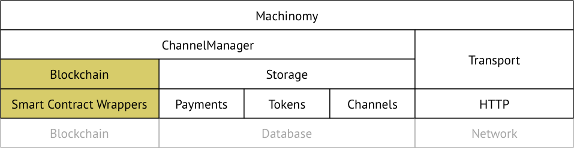

# Library Architecture



Notation:
- a layer uses the one on bottom,
- grayed out box is external to the library,
- mustard blocks belong to [contracts](https://github.com/machinomy/machinomy/tree/master/packages/contracts) package.

## Entities

Machinomy library user operates in domain entities. `ChannelManager`, `Transport` layers perform
serialisation of that to a structure more suitable for lower levels, and deserialize that back.


## Components

### Machinomy

Top-Level Interface for the library user.

- constructor(initialChannelValueStrategy, channelDepletionStrategy)
  - TBD initialChannelValueStrategy and channelDepletionStrategy are holes to be filled
  - instantiate channelManager(initialChannelValueStrategy, channelDepletionStrategy)
- buy(sender, receiver, hubHttpAddress, amount, meta, eventEmitter): (token, channelId)
  - channelId = channelManager.requireOpenChannel(sender, receiver, amount)
  - payment = channelManager.nextPayment(channelId, amount)
  - token = client.doPayment(hubHttpAddress, payment) // or some error
  - return (token, channelId)
- channels
  - Read all the channels from Storage
  - Set updated state for a channel from Blockchain, for all the channels
  - Return the list of the channels as `Channel` objects
- closeChannel(channelId)
  - channelManager.closeChannel(channelId)

### ChannelManager

Manages the state, both off-chain and on-chain.

- constructor
  - instantiate storage,
  - accept web3 provider for signing
- closeChannel
  - eventEmitter.emit('startClosing')
  - // push tx to the blockchain
  - eventEmitter.emit('channelIsClosed')
- nextPayment(channelId, amount)
  - // See if spentAmount ≤ channelValue
  - spentAmount = channel.spenAmount + amount
  - sign the payment
  - // Tracks nonces
  - **// TBD Must respect concurrency HOLE - FIGURE OUT THE MECHANISM IN PLACE**
  - **// Serialize calls somehow**
- channels
- channelById
- acceptPayment(payment)
  - check if payment is valid
  - // TBD Describe what makes a payment valid
- requireOpenChannel(sender, receiver, channelValue)
  - // Figure out if that is called sequentially: concurrency issue
  - if not channel is open between (sender, receiver) = ChannelManager.channelBySenderReceiver
    - openChannel(sender, receiver, eventEmitter)
  - channelBySenderReceiver // Query Off-Chain State : Promise(PaymentChannelJSON|null)
    - // Returns a channelId for sender-receiver pair
    - // No access to the database => Not a big deal => That means a payment can not be done at all.
    - // Query the channels storage abstraction
    - storage.channels.find(query = {}) // in pseudo-code

### Storage

Factory of Channels, Payments, and Tokens databases based on particular engine selected.

The database follows Database Access Object pattern.

### Transport

Namespace container. HTTP Client there is responsible for sending a payment to a hub,
and receiving a token. WebSocket Client is planned for the future.

HttpClient:
- sendPayment(payment)
  - // Format request to the hub
  - // Send to the hub
  - // Parse the response
  - // Response back with the token
- verifyToken(token)
  - // get token, send that to the hub
  - // parse the result, return boolean

`sendPayment` initiates a serialisation flow below:
```
AcceptPaymentRequest [payment → (req POST /accept) → payment] → (...) → [token → (res /accept) → token] AcceptPaymentResponse
``` 

namespace AcceptPaymentRequest:
- toRequest(payment, gateway)
- fromRequest(request)

namespace AcceptPaymentResponse:
- toResponse(token)
- fromResponse(token)

`verifyToken` initiates a serialisation flow below:
```
VerifyTokenRequest [token → (req GET /verify)→ token] → (...) → [bool → (res /verify) → bool] VerifyTokenResponse
```

namespace VerifyTokenRequest:
- toRequest(token, gateway)
- fromRequest(request)

namespace VerifyTokenResponse:
- toResponse(token)
- fromResponse(token) 

Reason for having these \*Request and \*Response objects is to have (de)serialisation in one place,
and reuse it on hub side.  

## How to get there

Goal of the refactoring is to harden the library for a production use. That involves minimising a scope for every component there is,
writing extensive tests, and independent review of the code, and architecture.

Current version of the code uses sender/receiver dichotomy all the way through the code.
The dichotomy makes sense for CLI, when you run the code on the same machine, and for closing the channel.
Apparently, if one closes a channel, that distinction of the role could be done in place. For CLI the configuration 
should be enforced for using different addresses for sender and receiver roles.     

As the refactoring is done, a pain point is left intact related to waiting for blockchain transactions. For that,
proposed approach is to add additional `EventEmitter` parameter to long-waiting methods. That `EventEmitter` is managed by
the library user. The library emits an event before and after long method is called.

TBD Set of events, and when these are emitted.
